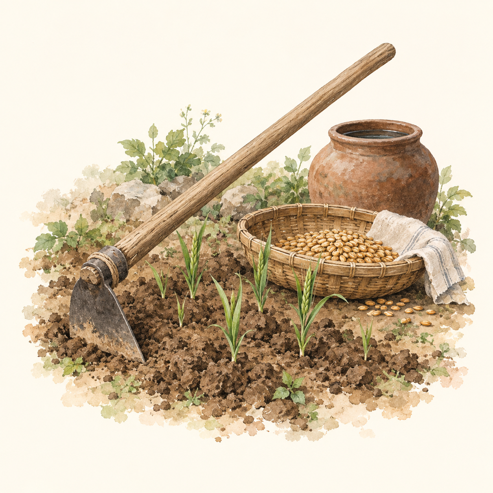
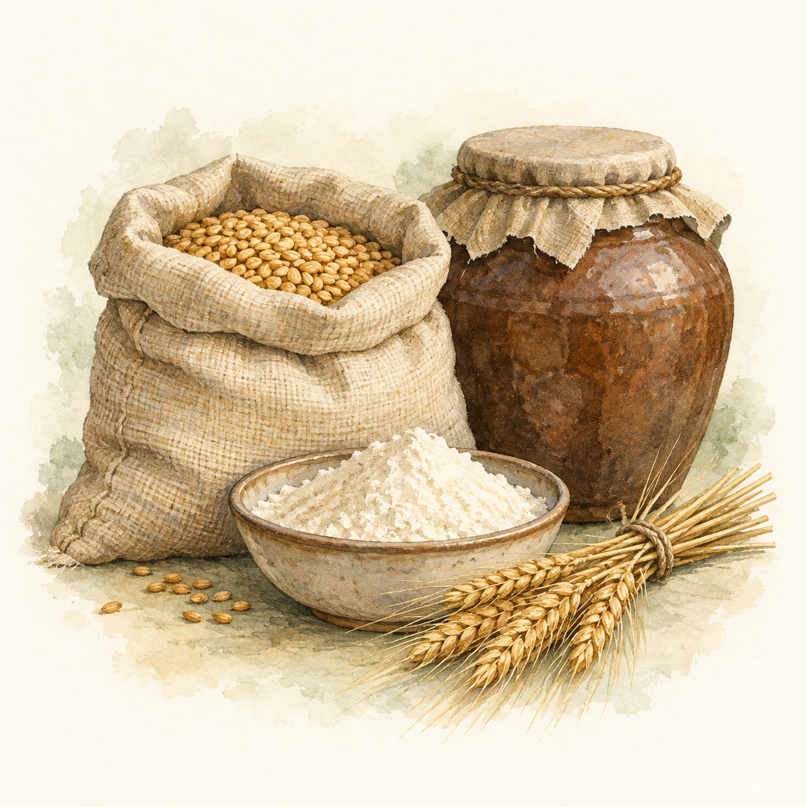
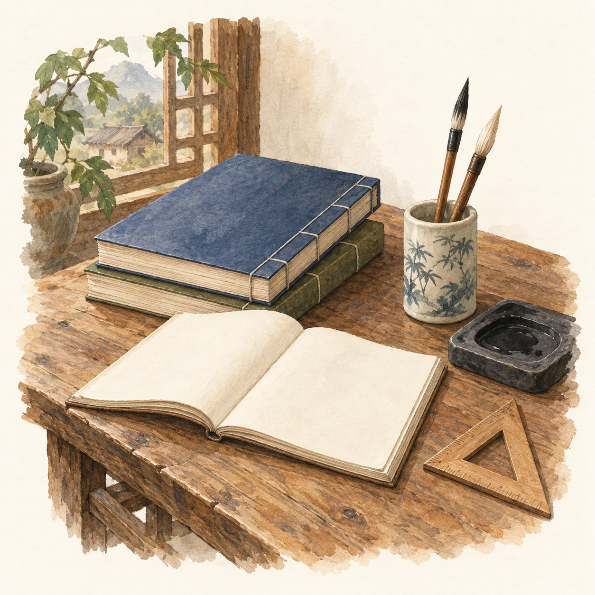
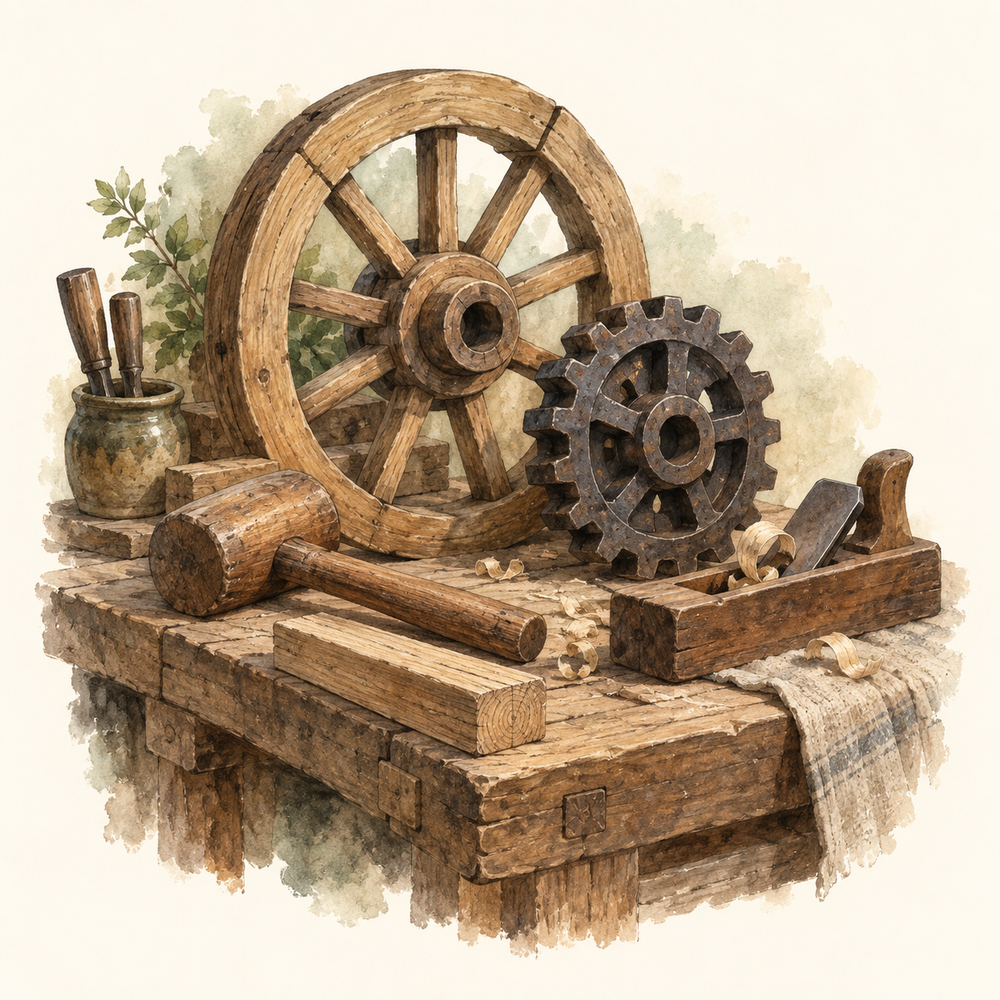
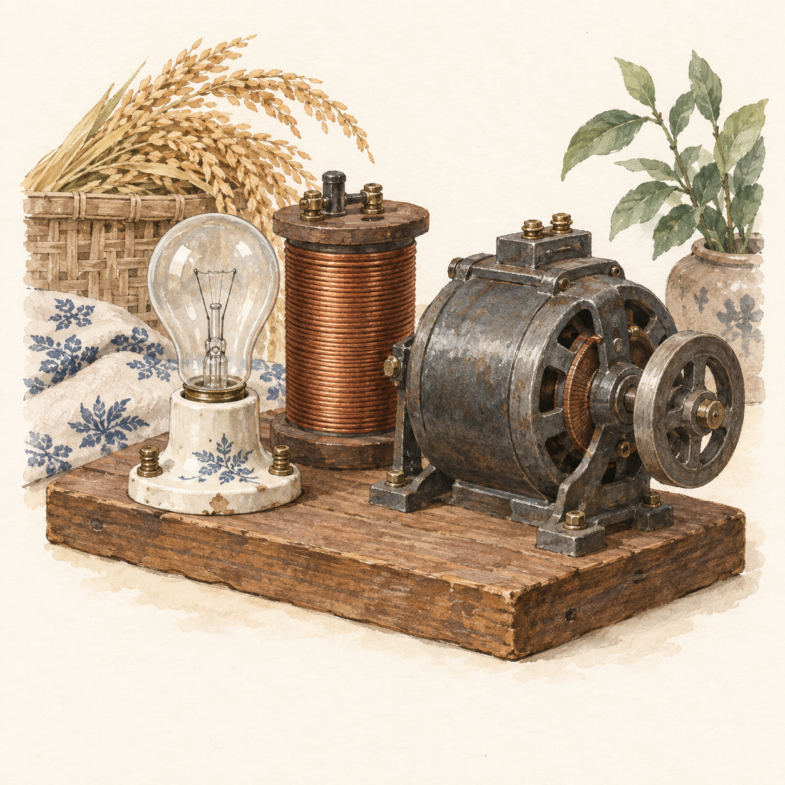
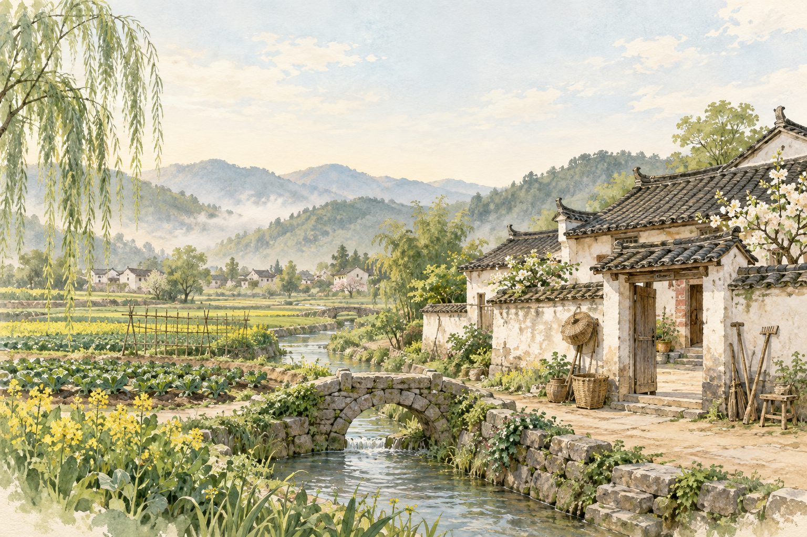
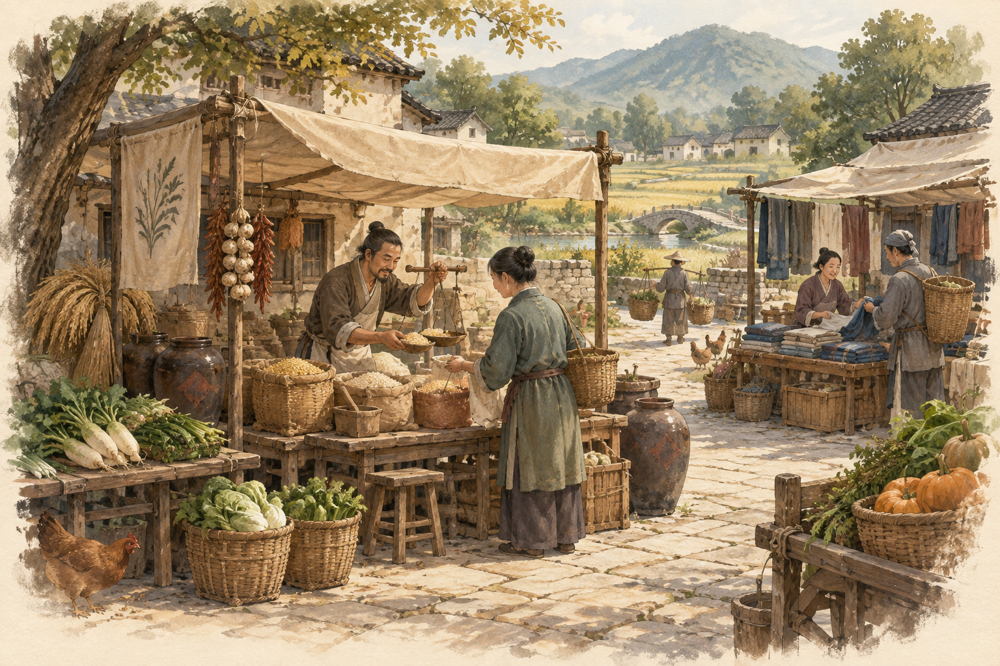
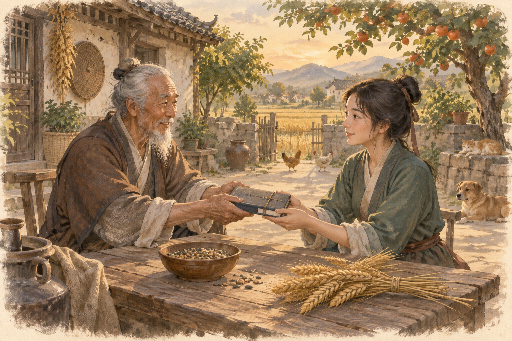

# 插画素材使用说明

更新：2026-09-20。已接入页面，下面的「当前接入」为现状；后文保留原素材交付说明与生成提示词。


## 当前接入

- 原 PNG/JPG 保留；页面使用同名 `-ui.webp`（最长边 384px、WebP quality 84）。14 张展示图合计约 307 KiB，不预加载全部素材。
- 科技树按农学、材料学、力学、组织学显示分类卡、节点缩略图与详情主题图；制造树按田间储存、部件机械、电力化工显示分类入口与主题图。插画是主题示意，不是每个产品的精确外观或已有资产。
- 开始页、本季看板和章节页眉已改用独立图，使用 contain 完整显示。集市页眉使用 `market-stall-ui.webp`；`chronicle-market.png` 大场景仍作为备用素材。
- 静态路由已支持 PNG、JPG、WebP 与对应 MIME。窄屏图片缩小，关系图只在自身容器横向滚动；节点保留键盘操作和完整状态的无障碍标签。
- 本轮已构建并在浏览器核验学堂/制造分类切换、详情跳转和 390/320px 布局；未运行 tests/ 中的测试。

### 本轮 Grok 补图

通过本机已登录的 Grok CLI 调用 `image_gen`，每张独立生成。源图为 1024×1024 JPG，非透明背景。

| 源文件 | 主题 | 展示文件 |
| --- | --- | --- |
| tech-materials.jpg | 陶罐、黏土、铁锭与亚麻布 | tech-materials-ui.webp |
| tech-mechanics.jpg | 木滑轮、绳索、木轮与齿轮 | tech-mechanics-ui.webp |
| product-tools.jpg | 锄头、镰刀与木槌 | product-tools-ui.webp |
| product-water.jpg | 静止手压泵与木桶 | product-water-ui.webp |

每张提示词 = 通用段 + 主题段：

```text
Common: Hand-painted watercolor and gouache on warm ivory paper, restrained Chinese rural family chronicle, muted sage greens, umber and wheat gold, simple recognizable centered still life, generous blank margin, soft edges. No text, numbers, diagrams, people, frames, logos, or watermark. 1:1 aspect ratio.
tech-materials: Earthenware pot, clay lump, iron ingot and a small folded linen cloth.
tech-mechanics: Simple wooden pulley with rope, wooden wheel and single iron gear at rest.
product-tools: Small iron hoe, sickle and wooden mallet in a compact arrangement.
product-water: A modest old-fashioned hand operated iron water pump with a wooden bucket, at rest, no flowing water.
```

## 原素材交付说明（接入前）

当前界面采用“家族编年史”：暖纸色、棕色操作控件、鼠尾草绿状态、手绘插画。这里的素材沿用这一方向。

已查看 `human-view.ts`、`player-guide.ts`、`style.css`、`server.ts` 及现有素材。页面分为本季、生活与家人、学习与制造、经营与交易、社会历程；部分页面随观察数据开放，不应因为有插画而新增入口。

当前实现有两点需要后续优化留意：

- `.painted-art` 使用 `chronicle-art.png` 六格图集，`background-size:300% 200%`。多个页面复用相同图格，集市目前也使用粮食图。
- 普通页眉插画桌面约 195px，窄屏约 145px；开始页约 160px，窄屏约 105px。应优先使用方形静物，不能把大场景硬塞进小页眉。本季看板已有紧凑布局，不宜再增加大横幅推低操作区。

运行界面核验限制：尝试用已有编译产物启动 `node dist/apps/board/server.js`，在规则校验处报“人生参数不完整”，未进入运行页面。本次建议基于当前源码、样式和插画目视检查，不视为已完成浏览器适配验收；未构建或运行测试。

## 素材目录与推荐用途

本目录共 10 张 PNG：原有六格图集 1 张、前一轮场景图 3 张、本轮方形图 6 张。全部保留原文件，未覆盖旧图。

| 文件 | 尺寸 / 大小 | 推荐位置 | 使用重点 |
| --- | --- | --- | --- |
| [chronicle-art.png](chronicle-art.png) | 1536×1024 / 3.13 MiB | 当前页面仍在使用 | 原有 3 列 × 2 行图集，保持现有裁格逻辑 |
| [chronicle-homestead.png](chronicle-homestead.png) | 1536×1024 / 3.20 MiB | 开始页、新旅程介绍 | 农舍、田地、溪桥；优先完整 3:2，顶部留白可辅助构图 |
| [chronicle-market.png](chronicle-market.png) | 1536×1024 / 3.19 MiB | 集市介绍区、交易章节大图 | 粮摊与布摊；不适合用作 100px 商品缩略图 |
| [chronicle-inheritance.png](chronicle-inheritance.png) | 1536×1024 / 3.08 MiB | 家族传承说明、换代回顾 | 保留两人面部和递书动作；不能作为实际角色肖像 |
| [chronicle-farming.png](chronicle-farming.png) | 1254×1254 / 2.21 MiB | 田地页眉、耕作说明卡 | 锄头、种篮、陶罐与幼苗；象征农业，不代表已播种 |
| [chronicle-pantry.png](chronicle-pantry.png) | 1254×1254 / 2.41 MiB | 生活安排、仓库页眉 | 粮袋、储粮罐、面粉与麦穗；不表示储粮足够 |
| [chronicle-study.png](chronicle-study.png) | 1254×1254 / 2.59 MiB | 学堂页眉、学习说明 | 书本、笔墨与三角尺；不代表课程已掌握 |
| [chronicle-workbench.png](chronicle-workbench.png) | 1254×1254 / 2.45 MiB | 制造、生产系统页眉 | 木轮、齿轮、木槌与刨子；不代表设备已拥有或生产中 |
| [chronicle-power.png](chronicle-power.png) | 1254×1254 / 2.55 MiB | 供能页眉、设备说明 | 未点亮的灯泡、线圈与发电机；不表示正在发电，也不是电路图 |
| [chronicle-journal.png](chronicle-journal.png) | 1254×1254 / 2.54 MiB | 存档、帮助、最近记事、阶段回顾 | 空白封面的册子、书签与银杏叶；不是“保存成功”标识 |

六张方图均有不透明暖纸底，并非透明 PNG。生成器没有严格保证统一的 15% 安全边距，实际主体偏饱满；优先完整显示，不要根据提示词假定边缘可以任意裁掉。

## 素材预览

### 田地与生活

| 耕作 | 粮储 |
| --- | --- |
|  |  |

### 学习与制造

| 学堂 | 制造 |
| --- | --- |
|  |  |

### 供能与记事

| 供能器件 | 记事存档 |
| --- | --- |
|  |  |

### 场景图







## 后续接入顺序

1. 普通页眉优先使用六张方图：田地、生活/仓库、学堂、制造/系统、供能、帮助/存档。
2. 开始页使用家宅场景，但保留“新建”“继续”等主操作在首屏。集市场景可放章节介绍区；如果空间紧张，继续使用小幅粮储装饰也可以。
3. 家人与传承页在说明或回顾区域使用传承场景。真实角色姓名、年龄、关系与交接结果继续单独显示。
4. 社会历程可使用记事册作为中性装饰。本批没有时代建筑套图，不应将农业家宅反复作为工业或现代阶段的准确图景。

这是素材建议，不要求每个页面都放图。操作密集的产品列表、配方、课程树、库存格子和错误提示优先保留文字与现有 `ui-icons.ts` 图标。

## 尺寸、裁切与布局

- 方图：建议桌面显示宽度 144–196px、窄屏 88–120px；`object-fit:contain`，保持 1:1。窄屏页眉标题较长时进一步缩小或隐藏装饰图，不应压缩按钮或说明。
- 场景图：以 3:2 完整显示为默认。家宅与集市可在实际预览后尝试 16:9 的轻度裁切，但不要直接切成极窄横条。传承图保持 3:2，避免裁掉人物面部或递书动作。
- 图片与正文分栏，正文放在独立纸色底上；不把报价、警告、按钮直接叠在复杂画面上。
- 暖纸色可沿用 `--paper:#fffaf0`。可尝试 `mix-blend-mode:multiply` 消除纸底接缝，但需要在实际容器背景下检查，避免发灰。它并不等于透明底。
- 一屏以一幅主要装饰图为宜。本季看板的小卡片不要都加载完整场景图。
- 非首屏图片使用 `loading="lazy"` 和 `decoding="async"`；首页主图不强制懒加载。为图片保留尺寸，避免内容跳动。
- PNG 为源素材，单张约 2.2–3.2 MiB。本轮九张新图合计约 24.2 MiB，不应一次性预加载。后续接入时可按实际显示尺寸导出较小版本并保留原图。
- 当前 `server.ts` 插画静态路由只接受 `.png`。如果后续导出 WebP/AVIF，必须同时调整静态路由和 MIME，不能仅替换图片后缀。

## 独立图片接入示例

以下代码供后续实施参考，本轮没有修改页面或 CSS：

```html

```

```css
.chapter-illustration {
  display: block;
  width: clamp(88px, 15vw, 196px);
  height: auto;
  aspect-ratio: 1;
  object-fit: contain;
  flex-shrink: 0;
  pointer-events: none;
}
```

建议使用独立类名。不要直接给单张图套用旧 `.painted-art`，否则原有 `background-size:300% 200%` 与 `.art-*` 的定位会错误放大和裁切。若继续采用 CSS 背景图，必须为独立图片重设 `background-size:contain`、`background-position:center`、`background-repeat:no-repeat`，并检查旧遮罩和定位是否仍合适。

页眉图纯装饰，使用空 `alt` 并从无障碍树隐藏。若某张插画作为独立内容展示，才添加对应的简短描述；不能把图中物件描述成玩家已拥有的资产。

## 游戏状态边界

- 田里长什么、粮食有多少、家庭成员是谁、系统有没有运行，只由观察数据和 HTML 状态展示决定。
- 插画不得控制行为、替代按钮或暗示已经完成学习、保存、建设、供电和换代。
- 供能图的灯泡未点亮只是静物构图，不等于当前存档处于停电状态。真实安装、启用、本季运行状态仍分别显示。
- 人物图是泛化叙事插画，不对应角色性别、年龄和外貌数据。
- 画中的作物、动物、摊位和器具属于环境装饰，不代表新增物品、机制或可交互建筑。
- 不通过绘制“成功”“满仓”“亮灯”等图片绕过实际状态判断。

## 生成方式与提示词

工具：内置 imagegen；未调用额外付费 API 或 CLI。下面记录本轮六张方图的完整提示词组成，便于后续保持风格。每张请求 = 通用段 + 对应主题段。提示词是生成意图，交付以实际图片为准，不保证每次复现相同构图。

### 通用段

```text
Use case: illustration-story. Create ONE standalone square decorative UI illustration for a Chinese family chronicle farming and civilization game. Warm ivory paper background #fffaf0, watercolor and gouache with fine pencil detailing, muted sage greens, natural umber and wheat gold, restrained realistic storybook style matching traditional Chinese rural life. Centered single coherent still-life vignette, large recognizable silhouettes readable at 145px, 15 percent empty paper margin on every side, softly feathered watercolor edges. No frame, no text, no glyphs, no numbers, no watermark, no interface. Opaque paper background, not transparent. No people, no fantasy. 
```

### chronicle-farming.png

```text
A small patch of turned earth with a few young wheat shoots, one simple wooden handled hoe resting diagonally, a shallow wicker seed basket and small earthenware water jar. Show a generic symbolic agricultural still life, not a field map and not a harvest scene. Focus on the hoe, shoots and basket as a balanced compact cluster.
```

### chronicle-pantry.png

```text
A compact household food-storage still life: one linen grain sack with visible wheat, one covered brown ceramic storage jar, one shallow bowl of flour, and a short bundle of wheat ears. Distinct simple silhouettes, modest supplies, no lavish feast, no coins. This is a decorative category image, not an inventory diagram.
```

### chronicle-study.png

```text
A small corner of a rustic scholar's wooden table with two clothbound books, an open blank notebook, ceramic brush holder with two brushes, an inkstone, and a small wooden geometry triangle. The books are the main silhouette, objects in one compact coherent arrangement. Every page and cover blank, no writing, no diagrams. This represents learning, not completed research.
```

### chronicle-workbench.png

```text
A compact rustic manufacturing workbench still life: a small wooden wheel upright at the back, a single dark iron gear, a wooden mallet, a simple hand plane and short timber offcut. Tools visibly at rest. No factory background, no worker, no steam or sparks. Three-quarter view, wheel and gear form strong silhouettes. Generic manufacturing category art, not an engineering diagram.
```

### chronicle-power.png

```text
A compact still life of early electrical components resting on a small wooden base: one clear UNLIT incandescent bulb in a porcelain holder, one copper-wire coil and one modest small early dynamo with iron casing. No light glow, no spark, no motion, no wires suggesting a working circuit. Quiet neutral daylight. This represents power equipment as a topic, not electricity actually being generated; not a technical wiring diagram.
```

### chronicle-journal.png

```text
A compact family archive still life: one closed clothbound journal with a plain blank cover, a second thinner volume underneath, a simple pencil lying diagonally, a loose blank sheet with a pressed gingko leaf, and a plain cloth bookmark. Muted brown and sage bindings, warm ivory paper. No seals, no writing, no dates, no checkmarks or achievement symbols. Quiet memory and continuity, ideal for save-selection or recent-events UI.
```

### 前一轮三张场景的续作要点

三图已在同一目录保存，本轮未重新生成。续作保持横向 3:2、中国乡村、暖纸水彩水粉、柔化边缘、无字无水印：

- `chronicle-homestead.png`：春晨农舍、田地、溪流、石桥与柳树；顶部安静留白，无人物。
- `chronicle-market.png`：乡间院落里的粮食、蔬菜与布匹摊位，少量村民自然交易；温暖日光。
- `chronicle-inheritance.png`：庭院中祖辈向年轻后辈递交无字家族册子；种碗、麦束、夕阳，克制温暖。

## 本次核验范围

已目视检查六张新图的主题、风格、主要构图与供能图灯泡未点亮；已核对所有 PNG 的尺寸、文件大小，以及六张新图复制前后的 SHA-256 一致性。未做实际页面裁切与手机布局验收，未改机制、页面逻辑或现有引用，未运行测试。后续接入页面后，短时检查对应页及 320/390px 窄屏即可。


## 仓库与田地接入（2026-09-20）

本轮经本机 Grok CLI 的 image_gen 新增四张 1248×832 JPG 原图，并导出 600×400、quality 84 的 WebP 展示图：

- `warehouse.jpg` / `warehouse-ui.webp`：仓库页场景与页眉。架子与容器只是场景，不对应实时库存。
- `field-empty.jpg` / `field-empty-ui.webp`：无作物时的田地。
- `field-growing.jpg` / `field-growing-ui.webp`：已播种且 growth < duration。
- `field-ready.jpg` / `field-ready-ui.webp`：已播种且 growth >= duration。

田地阶段图用于田地页和本季看板，作物种类、预计收成仍以观察输出的文字为准。仓库新增口粮、种子、原料、加工品与其他分类，不隐藏已有正数库存；食品保护容量不解释为总仓储上限。

生成提示词（每张为通用段加对应主题）：

```text
Common: Landscape 3:2 decorative UI illustration. Match a Chinese rural family chronicle game: restrained watercolor and gouache, warm ivory paper, muted sage green and umber, soft faded outer edges, no frame, no people, no writing, no numbers, no interface or watermark.
warehouse: A modest timber storage alcove, mostly empty shelves, a few closed earthenware jars, empty wicker baskets and folded linen sacks, tidy understated still life, not abundant food.
field-empty: A small rectangular cultivated plot with neat bare soil furrows, low wooden boundary and a hoe resting beside it, no plants.
field-growing: Similar small cultivated plot, rows of low generic green leafy sprouts, early growth, no ripe grain or harvest baskets.
field-ready: Similar small plot with generic mature ochre and sage crop rows, quiet harvest-season mood, crops still rooted, no collected harvest.
Constraint: These are symbolic stage illustrations not accurate crop species.
```

已构建，并短时检查仓库、田地、播种后的图片切换和窄屏布局；未运行 tests/，未生成试玩记录文件。

## 桌面 Web 物品图标与田地动画

当前开发只核验桌面 Web，手机端暂不作为适配或验收目标，详见根 AGENTS.md。

新增 41 张独立 Grok image_gen 图片：40 个 ALL_GOODS 条目（含三种种子）以及即食粮 food。源文件为 `item-<物品ID>.jpg`；界面文件为 `item-<物品ID>-ui.webp`，最长边 192px、quality 84，合计约 86 KiB。仓库物品只在真实库存为正时出现；种子卡片显示实际库存，播种仍走原行动接口。图片均为不透明背景，不是精确物品数量示意。

通用生成提示词：

```text
A single centered isolated item or small coherent pile, watercolor and gouache with fine pencil detail, warm ivory paper background, muted sage and umber, restrained Chinese family chronicle game inventory art, bold silhouette readable at 64 pixels, ample margins, no text, labels, symbols, numerals, watermark, border or UI. Aspect 1:1.
```

主题段按以下物品分别附加，逐张生成，不使用拼图裁切：

```text
wood: short cut timber logs
clay: lump of moist brown clay
ore: rough iron ore rocks
iron: dark iron ingots
wheat: small bowl of wheat grains with two wheat ears
soy: soybeans in small bowl
flax: bundle of raw flax stalks
straw: bundle of dry straw
flour: small open sack of white flour
oil: small earthenware jug with golden vegetable oil bowl
fiber: loose pale flax fibers
rope: coiled rustic hemp rope
compost: small woven basket of dark mature compost
ceramics: plain curved ceramic pipe components
brick: two red refractory bricks
seal: three dark rubber sealing rings
valve: small brass hand valve
shaft: short machined metal drive shaft
spring: one helical steel spring
solution: unlabelled clear glass flask of pale liquid
seedWheat: small open cloth pouch of elongated wheat seeds, no ears or sprouts
seedSoy: small open cloth pouch of round soybean seeds, no sprouts
seedFlax: small open cloth pouch of tiny glossy brown flax seeds, no sprouts
copper: reddish copper ingots
feedstock: unlabelled ceramic vessel with pale chemical granules
mineral: small pile of mineral fertilizer rocks
silica: clear and milky quartz stones
polymer: small ivory polymer pellets and insulating sleeve
wire: small spool of thin insulated copper wire with copper end
coil: copper motor winding coil
cable: short coil of thick dark power cable
fuel: plain closed metal fuel can without labels
nutrient: small plain sack of fertilizer granules
battery: plain compact battery cell with two terminals no symbols
silicon: dark reflective silicon chunks
circuit: small green electronic circuit board no text
controller: small closed industrial controller box with blank dark display no buttons with text
composite: layered composite structural beam offcut
alumina: white alumina powder in a ceramic bowl
aluminium: silvery aluminium ingots
food: modest bowl of cooked grain
```

田地专用场景在 `field-scene.ts`：使用 SVG 与 CSS，观察中的 crop/growth/duration 决定植株种类、大小与成熟色彩，公开 weather 决定雨滴装饰。45 株植株仅为示意布局，不代表产量。微风、云朵与雨滴是装饰，不推进季节或改变世界。提供暂停复选框，尊重 prefers-reduced-motion。没有引入视频、动画依赖或新增机制。场景替代田地页的旧静态阶段图；原 JPG 与本季看板阶段图继续保留。

已构建并检查桌面田地场景、暂停/恢复、种子卡和仓库图标；按 ALL_GOODS 清单核对 41 项展示文件全部存在。未运行 tests/，不保存试玩记录。


## 人物年龄与时代肖像

2026-09-20 使用内置 imagegen 重新生成全部人物图。男女各两个身份，每个身份覆盖六个年龄段和四个时代，共 16 张六格年龄图、96 个肖像。每张为 1536×1024 JPEG，按从左到右、从上到下排列幼年、儿童、少年、青年、中年、老年；页面按无间隔的 3×2 网格显示当前年龄格，每格 512×512。

文件命名为 `person-<male|female>-<01|02><时代后缀>.jpg`：农业村落无后缀，集镇分工 `-town`，工业城镇 `-industry`，现代社会 `-modern`。时代主要通过日常衣着与发式区分，没有职业制服或能力加成。每个时代从独立的新随机人物开始；人物在本时代随年龄切换肖像，旧时代人物保留历史形象，不跨时代换装继任。

新版先生成四套农业形象，再将各自农业图作为输入参考生成其余时代，维持五官、头肩构图和年龄顺序。集镇采用整齐织物、领口与盘扣，工业采用衬衫和日常夹克，现代采用 T 恤、针织衫与轻便外套。农业图透明区域在 JPEG 导出时以 #f4eddf 填底；其余时代保留生成的暖灰褐色背景。旧农业图也已替换，人物身份、年龄阈值、时代映射及存档结构不变。


## 顶部导航与状态素材

`ui-navigation-preview.jpg` 是旧版 Grok 样张，不再代表当前导航。当前七张 `ui-nav-*-ui.webp` 已由内置 imagegen 重绘为透明底独立插图，导出为 256×256 WebP，页面统一以 68×68 显示，移除导航图的 multiply 混合。社会历程改为紧凑的三阶段建筑组合；集市使用摊位，经营与交易使用轮具、齿轮和货包，避免两个入口含义重复。`ui-status-preview.jpg` 及 `ui-status-*-ui.webp` 状态图沿用原版本。本轮不改状态图。图片只负责呈现，导航标签与动态数值仍为真实文本。


## 商城商品图与「集市」导航（2026-09-20）

「商城」从「经营与交易」篇章移出，成为顶部独立篇章「集市」；商城全部商品条目与采购清单行配图，经 `shopImage()`（`apps/board/illustration.ts`）接入：物资复用既有 `item-<id>-ui.webp`，设备用本轮新生成的 `device-<ID>-ui.webp`，教材统一用 `item-book-ui.webp`，家庭资产用 `item-granary-ui.webp` / `item-library-ui.webp`；缺图时回退到既有主题图。生活页的「买入4口粮」行动移到商城「物资」分类顶部。

本轮经本机 Grok CLI（ACP stdio 无头模式）image_gen 新增 38 张 JPG 原图，并导出 WebP 展示图（商品最长边 192px、导航 128px、quality 84）：

- 34 张设备图 `device-<ID>`：W01,W03,P01,P03,T01,T03,F02,F03,S01,S02,S03,U01,U02,U04,U05,U06,U08,U09,U10（农工业）；W07,E01,E02,E04,F07,T07,F09,N08,S08,U08M,U09M,H09,LAMP,TELEGRAPH,ELECTROLYZER（现代/电力）。F04/F05/E03/F10/N10 商店不出售，未生成。
- `item-book`（全部教材共用）、`item-granary`（家庭粮仓）、`item-library`（家学书室）。
- `ui-nav-market`：顶部「集市」篇章标签图标，风格对齐既有 `ui-nav-*`。

该旧批次的生成提示词存档于 `artifacts/image-gen/prompts.json`（通用段沿用 41 张物品图的暖纸水彩静物规范），驱动脚本 `artifacts/image-gen/gen.mjs`、转换脚本 `artifacts/image-gen/convert.py`。该批商品图片为不透明背景、静物示意，不代表已拥有设备或实时库存；当前导航已替换为下述透明底版本。

## 导航与人物重绘说明（2026-09-20，当前版本）

本节覆盖上文旧批次中有关导航与人物的生成来源、尺寸及背景说明；商品图不受影响。现有文件原位更新，可通过 Git 查看旧版。

### 文件与用途

- 导航：`ui-nav-{season,farm,family,study,market,trade,society}-ui.webp`，七张透明底 256×256 WebP；沿用 `chromeImage()` 引用。
- 人物：`person-{male,female}-{01,02}{,-town,-industry,-modern}.jpg`，16 张 1536×1024 六格图集；沿用 `personPortrait()` 引用。不得给图集增加边框或格间距，否则百分比定位会偏移。
- 年龄分格保持原规则：小于 6、12、18、35、55 岁依次取前五格，55 岁起取最后一格。绘图中的代表年龄只是视觉参照，不改变阈值。
- `ui-navigation-preview.jpg`、`person-era-preview.jpg` 为历史样张，不代表本次成品。当前成品以实际引用文件为准。
- 图像生成与换装使用内置 imagegen。Sharp 仅作部署格式导出、导航缩小和 JPEG 透明区域填底，没有程序绘制人物或替代生成。
- 四套基础形象按脸型和体型区分；时代版本以各自基础图作参考。生成式肖像仍会有细节差异，不将外貌解释为人物能力或亲缘判定依据。

### 导航提示词

每张请求由以下通用段加主题段组成。

```text
Use case: illustration-story. Generate ONE isolated square navigation illustration for a Chinese family chronicle desktop game. TRUE TRANSPARENT BACKGROUND with alpha, no paper square, no backdrop, no shadow rectangle, no border, no lettering or numbers. Hand-painted gouache, elegant simplified shapes, subtle brush texture, muted sage green and warm walnut brown with small ochre accents. Not photorealistic, not 3D, not cartoon emoji. Clear bold silhouette readable at 64px. Center the compact subject, occupying about 78 percent of square width and height with equal transparent margins. Minimal detail, consistent visual weight, no tiny scenery.
```

- `season`：A small upright spiral desk calendar, a single cream blank page and a tiny ochre sun peeking above the top corner. No marks on the page.
- `farm`：A single modest Chinese tiled-roof farmhouse beside a prominent upright sheaf of wheat and two simple green leaves. Compact triangular composition.
- `family`：A warm compact bust-length group of three Chinese family members: adult woman, adult man, and one child centered in front. Simple distinct faces, sage and umber everyday clothes. The three heads create a readable triangular silhouette. No full bodies.
- `study`：An open cream blank book with sage cover and one small wooden gear tucked at the lower right. Strong open-book silhouette. No text, no markings.
- `market`：One charming small wooden market stall, broad sage canvas awning above a counter with exactly two simple baskets of produce. Compact frontal three-quarter view, big awning silhouette. No people, no sign.
- `trade`：A compact wooden workshop wheel with one small iron gear and a tied cloth parcel at its foot. Express production and trade, not a market stall. Strong wheel silhouette, no building.
- `society`：Three compact ascending architectural silhouettes grouped tightly: a rural tiled-roof home, a brick workshop with short chimney, and a simple modest modern building. Sage, umber, ivory. No skyline panorama, no smoke, no tiny windows. Balanced nearly square silhouette.

### 人物提示词

每张基础年龄图由通用段、身份段、农业时代段组成。其余时代使用对应农业图作为参考，要求保留身份、年龄格和构图，只变更发型及衣着；背景提示改为与参考协调的暖灰褐色。提示词表达生成意图，实际交付背景见上文。

```text
Use case: illustration-story. Create a production-ready character age sprite sheet for a Chinese family chronicle game. EXACTLY 3 equal columns and 2 equal rows on a landscape 3:2 canvas; SIX equal square cells tile the entire canvas with NO gutters, NO borders, NO panel frames, NO labels. Every cell has identical solid warm ivory background #f4eddf. Each cell contains exactly one centered head-and-shoulders portrait, entire hairstyle visible with 8% top clearance, shoulders cut only at that cell's bottom. Head scale consistent, no portrait crosses cell boundaries. Painterly gouache with clear elegant shapes and subtle pencil detail, warm natural skin, sage and umber clothing, readable kind expressive faces at 176px, NOT photorealistic, not anime, no glamour retouching. SAME Chinese person aging naturally in all six cells. In strict left-to-right top-to-bottom order ages: 3-year-old toddler, 8-year-old child, 15-year-old teenager, 27-year-old young adult, 45-year-old middle-aged adult, 70-year-old elder. Teenager must visibly be adolescent and distinct from adult, middle-aged face has subtle aging, elder has grey hair and wrinkles. Natural restrained expressions, no props, no hands, no text, no watermark.
```

身份段：

- `male-01`：Male identity A: slim oval face, straight brows, almond eyes, defined but gentle cheekbones, warm tan complexion, thoughtful subtle smile.
- `male-02`：Male identity B: broader round face, thick slightly arched brows, a wider nose, warm medium complexion, friendly open smile; stockier shoulders than identity A.
- `female-01`：Female identity A: slim oval face, gently arched brows, almond eyes, softly defined cheekbones, warm medium complexion, thoughtful subtle smile.
- `female-02`：Female identity B: round face, straight brows, bright smiling eyes, wider cheeks, warm tan complexion, sturdy build, friendly open smile distinct from identity A.

时代段：

- 农业：pre-industrial Chinese agrarian village. Simple worn cotton cross-collar or plain wrap garments, natural undyed linen, muted sage and brown, age-appropriate traditional tied hair, no hats, no modern clothes. No costume opulence.
- `town`：Chinese market-town craft era before industrialization: neatly woven plain cotton garments, simple standing collar and cloth knot closures, orderly age-appropriate tied hair or braids. No opulent silk, no jewelry, no occupational uniform.
- `industry`：Chinese early industrial town, mid twentieth century everyday civilian life: short practical hair for males, neat short bob or tied braids for females, plain cotton shirts, simple collared everyday jackets in muted blue-grey, sage and brown. No uniforms, badges, hats, text or logos.
- `modern`：Present-day ordinary Chinese civilian daily life: natural age-appropriate contemporary hair, simple T-shirts, soft cardigans and lightweight everyday jackets, muted sage, ivory and warm brown. No traditional topknots or wrap robes, no logos, no uniforms.

参考图约束：

```text
Use the reference ONLY for face identity, painterly style, six-cell grid alignment and portrait scale. Create a new separate era variant sheet. Preserve exactly the same six age stages and identity. Change clothing and hair according to the era below.
```

### 后续维护

导航和人物都只改呈现，不改变游戏世界。桌面检查重点是：七张导航加载、选中底色下无方形色块、头像不串格，以及少年和中年能区分。后续只需检查相关桌面页面，不新增手机适配或窄屏验收。完整 96 个肖像已按图集目视检查；无需通过推进游戏到全部时代来检查静态素材。


## 开始页故事素材（2026-09-20）

经本机 Grok CLI（`artifacts/image-gen/gen.mjs`，提示词在 `prompts.json`）新增两张开始页主题图：

- `story-veil.jpg`（1248×832）→ `story-veil-ui.webp`（960×640，q84）：入口页横幅。薄雾山谷中的隐世家宅与梯田、一条蜿蜒小径，呼应「化整为零、散居各地」。纯装饰，不代表任何存档场景。
- `story-token.jpg`（1024×1024）→ `story-token-ui.webp`（384×384，q84）：开始页题图。无字素玉佩、编绳与银杏叶静物，呼应家族信物。信物机制尚未实装，图片只是主题示意。

两图均为不透明暖纸底，页面以 `mix-blend-mode:multiply` 融入纸色容器；已目视检查主题、风格与无文字。


## 农舍事务卡片插画（2026-09-21）

通过本机 Grok Build CLI 的 `image_gen` 生成 `farm-home-atlas.jpg`（1024×1024），按用户红框位置替换农舍横幅及六张功能卡片的线框图标。只改呈现。

页面使用七张 300×300 WebP：`farm-home-home`（农舍）、`farm-home-porridge`（麦粥）、`farm-home-beans`（炖豆）、`farm-home-mixed`（麦豆饭）、`farm-home-rest`（休息）、`farm-home-reserves`（储粮）、`farm-home-gather`（采集）。图集第三行余下两格未用于页面。裁掉生成的纸片边框，对边缘连通的浅灰底做透明度处理，保留器物和水彩阴影；页面以 multiply 融入原有纸色。原始图集保留，便于重新裁切。

最终绘图提示词：

```text
A precisely aligned 3 by 3 contact sheet of nine separate Chinese pastoral watercolor spot illustrations on pure white background, equal square cells, no borders, no text, no letters, no people. Each object centered in its cell with generous white margins, completely contained in its cell. Muted sage green, warm ochre, ink grey, delicate handpainted rice-paper watercolor aesthetic. Row 1: small rustic tiled farmhouse with warm kitchen window; ceramic bowl of wheat porridge and wheat stalk; earthenware bowl of stewed brown soybeans. Row 2: ceramic bowl of mixed wheat grains and beans; resting bamboo mat with cushion and herbal tea; woven basket of grain and storage jar. Row 3: gathering basket with firewood and small hand hoe; a sprouting seed; small cooking stove. Square image at highest supported resolution.
```

接入位置：`farm-view.ts` 的农舍 panel；`farm-animation/scene.css` 的 `.farm-painted-art`。图片为装饰性，名称、材料、状态与行动仍由原有可访问文本表达。未修改田地场景、游戏机制或数值。
