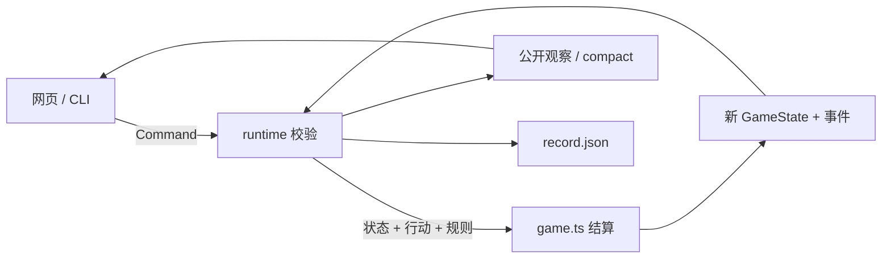

# 现行架构

完整业务流程见 [SYSTEM_OVERVIEW.md](SYSTEM_OVERVIEW.md)。当前只支持规则 **0.27.0**。

## 一条行动的路径



`game` 不读文件、不调模型。`runtime` 保存当前局 JSON，不选择行动。`present` 只把公开观察收成摘要。CLI 和网页组合这些模块。

## 三份数据

| 数据 | 内容 | 修改方式 |
| --- | --- | --- |
| Ruleset | `rulesets/social-eras.v27.json` | 校验后冻结；`resolveRuleset` 可覆盖有界参数 |
| GameState | 时钟、家户、经济子状态、随机状态 | 仅 `transition` 返回新对象 |
| 存档 | 规则拷贝、种子、命令链、**当前 state** | 朴素 JSON 读写，不整链重放 |

## 目录

```text
src/
  game/          唯一结算
  present/       AI 精简观察
  runtime/       命令、会话、JSON 存档
apps/
  host/          加载当前 v27
  cli/           new / observe / act
  board/         人类对局
scripts/player.mjs
rulesets/social-eras.v27.json
tests/
playtests/
docs/
```

命令必须带 `commandId` 和 `expectedRevision`。同命令幂等，过期 revision 和非法行动拒绝。写档用临时文件替换，失败不覆盖原档。

`scripts/player.mjs` 只允许 observe / act，不是对任意 shell 的安全沙箱。
