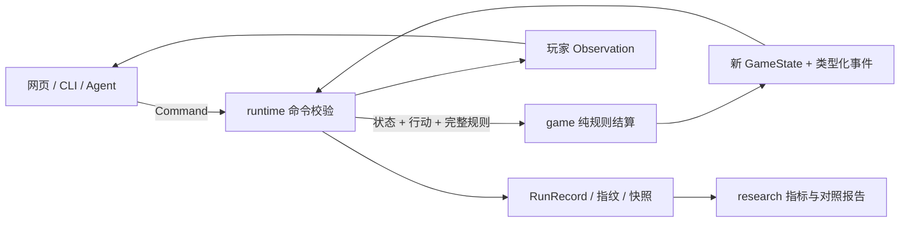

# 重构后的规则实验架构

工程 v0.2.0；桌游规则仍为 v0.1.0。本次改变职责划分、运行记录和验证方式，不改变学习费用、产出或代际规则。

借鉴 [TAG](https://github.com/GAIGResearch/TabletopGames) 对 GameState、ForwardModel、Action、Parameters、Player 和评估的拆分，以及 [TextArena](https://github.com/LeonGuertler/TextArena) 的环境与代理接口。这里只采用组织经验，不引入它们的运行框架。

## 一条行动的路径



`game` 不读取文件、调用模型或计算研究分数。`runtime` 负责可复现执行与保存，不选择策略。`agents` 只接收观察，返回行动；`research` 组织有上限的实验，并从事件推导指标。CLI 和网页是组合这些模块的入口。

## 三份不同的数据

| 数据 | 内容 | 修改方式 |
| --- | --- | --- |
| Ruleset | 规则版本、完整参数、参数范围、场景、科技节点及前置 | 从冻结 JSON 校验解析；候选生成独立副本 |
| GameState | 时钟、世界与地区、家庭、人物、资产、项目、档案、随机状态 | 仅 transition 返回新状态；输入和输出冻结 |
| RunRecord | 实现身份、完整规则与指纹、种子、场景、代理、命令、事件、状态哈希、快照 | runtime 顺序追加；重放核对 |

人物、渠道、种源和试种项目使用稳定 ID，家庭持有引用。交接切换经营者，保留前代人物记录和实际传下来的资料、设施与项目；不会复制前代全部能力。世界科技与地区教师分别表示社会条件和学习来源，个人节点表示已学会的专精。

能力继续用掌握节点、学习记录和实践条件表达。AP、口粮等资源以及学习所需次数仍是数值。未来增加工艺分支时先定义行动如何改变世界，不以研究评分代替规则因果。

`Observation` 是专门生成的公开 DTO，不暴露随机状态、种子或退役人物全集。网页的人类调试信息可读取运行清单；模型接口只拿 `observeSession()`。

## 目录与扩展位置

```text
src/
  game/
    model/         状态、行动、事件类型
    actions/       行动条件、成本及对应效果
    systems/       学习、生产、项目、时间、传承
    ruleset.ts     完整配置校验与候选解析
    observation.ts 玩家观察投影
    game.ts        初始状态、合法行动、唯一转换入口
  runtime/         会话、记录、重放、文件保存
  agents/
    contract.ts    代理接口
    scripted/      四种原有脚本基线
    llm/           JSON 决策校验与可注入模型调用
  research/        调度、事件统计、配对比较
apps/
  cli/             文件与实验命令入口
  board/           浏览器桌游界面及本地静态服务
rulesets/           冻结基线
experiments/        实验计划与参数候选
artifacts/          自动生成的记录、报告与失败信息
tests/              旧轨迹基准、运行与依赖边界检查
docs/               规则、架构和研究协议
```

增加节点需要前置、学习来源、实践条件、成本及用途；现有机制无法表达用途时，显式扩充系统和事件。现在不引入插件容器、微服务、ECS 或通用公式解释器。

## 防止后续 AI 意外破坏

1. **可恢复基线**：Git 标签 `baseline/rules-lab-0.1.0` 保存原实现。重构在 `codex/modular-rules-lab` 分支；完整 ZIP 备份位于同级 `civilizationMini.backups`，包含旧存档和报告。
2. **独立行为证据**：`tests/fixtures/legacy-v1.json` 是修改前采集的 8 条轨迹、349 个状态，不可为迁就新实现重录。检查逐步资源、行动可用性、成长、传承、事件统计和最终指标。
3. **不静默混用规则**：v2 存档内嵌完整配置，核对配置 SHA-256、规则实现指纹、命令链、事件和状态。实现指纹取自编译后的 `src/game` 模块。变更规则实现后旧 v2 会拒绝重放，需要对应构建或显式迁移。
4. **安全执行协议**：命令必须携带 commandId 和 expectedRevision；同命令重试幂等，不同内容复用 ID、过期 revision 和非法行动拒绝。文件写入使用独占锁、旧版本历史备份与临时文件替换。异常残留锁交给人工检查，不自动删除。
5. **候选与基线分开**：参数白名单、范围和技术依赖校验；实验记录完整配置，按相同种子、场景和代理配对比较。报告没有自动采纳接口。结构改动需新的规则版本、因果测试与迁移说明。
6. **工具权限由宿主控制**：`scripts/player.mjs` 限制子进程入口和写入目录，但不是对仍有任意 shell 权限的 AI 的安全沙箱。哈希能够发现不一致，不能阻止具有写权限的主体重算哈希。真正隔离须由外部宿主只提供观察/行动工具，并保护基线、测试与审批权限。

## 兼容与验证

原 `runs/`、`reports/` 不修改。CLI 用 `import --run 新ID --file 旧文件` 将 v1 重放成 v2；迁移强制核对冻结 v1 配置指纹，原文件保留。浏览器使用新 localStorage 键，首次迁移不删除 v1 原文。导入失败不覆盖现存运行。

重放验证适用于当前实现，不承诺跨未来版本自动兼容。存档不是签名文件，不提供对恶意作者的真实性认证；本地文件锁也不是多机事务。

执行 `npm test` 会构建并运行必要的基准、命令/存档保护与分层检查。界面变更另做短时试玩；只有研究问题需要时才增加对照实验。本次默认规则、七个节点及历史研究结论均未调整。
