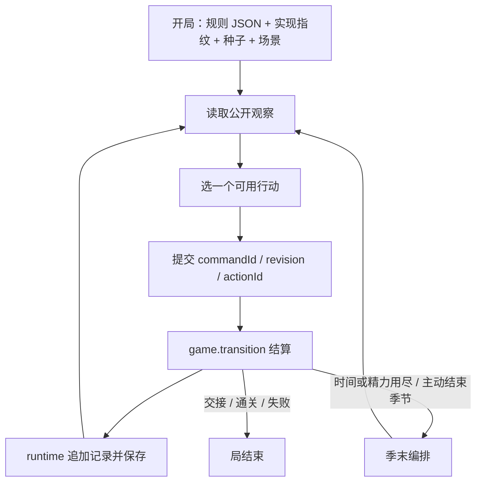
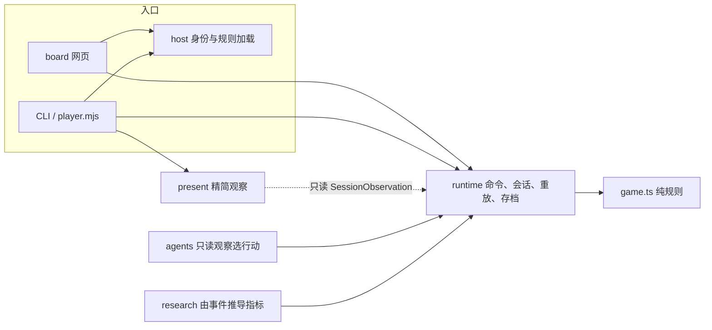
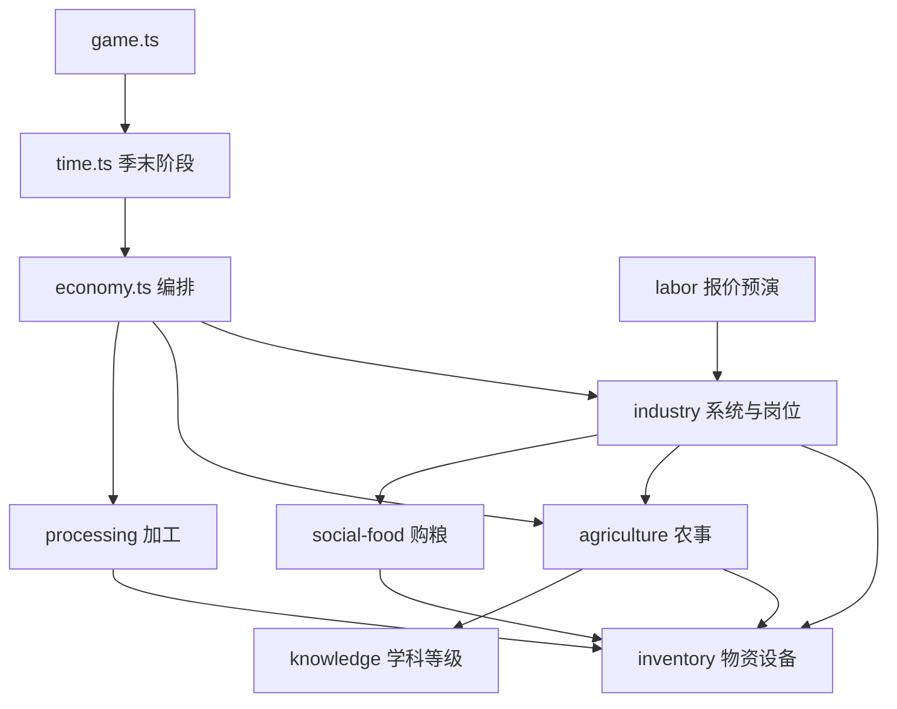

# 业务流程与实现架构

读者：要一次看清“游戏在玩什么”和“代码怎么结算”的人。

当前默认规则与工程 **0.27.0**（`rulesets/social-eras.v27.json`）。分层约束由 [ARCHITECTURE.md](ARCHITECTURE.md) 维护；本版玩法细节由 [CURRENT_GAMEPLAY_V27.md](CURRENT_GAMEPLAY_V27.md) 维护。本文描述现行默认局的完整业务循环和实现结构，不替代各版本规则说明书，也不把历史实验当成当前结论。

## 1. 项目定位

这是独立规则预研，不是 Cocos 正式游戏，也不改 `../remake`。目标是把普通人跨代生活里的世界过程做成可重放的桌游式模拟：观察公开状态、提交一个行动、得到确定结果。

约束：

- `src/game/game.ts` 是唯一结算权威。网页、命令行、脚本策略、大模型文案都不能直接改状态。
- 策略只能读 `observeSession()`。种子、随机状态、未来天气不进观察。
- 比较实验用同一场景、种子、策略；不混用历史版本存档。
- 规则数字在 JSON；物品、配方、结算公式在 TypeScript。改实现会换指纹，旧档按原身份验证。

## 2. 玩家业务循环

人类走浏览器 `/play`，AI 走 `scripts/player.mjs`。两端共用同一套规则和行动接口，存档分开，不自动同步。



AI 默认读精简观察。成功 `act` 已带新 revision 和摘要，不必再机械 `observe`。科技树、产品、系统、全部不可用原因用 `--section` 按需取。冲突、失败或文件更新警告时重新观察。完整 JSON / text 仍可用。

浏览器从 `/start` 建档，键为 `civilization-mini.social-eras.v27`；开新局前原样备份旧字节，不迁移旧档。

## 3. 一季里在经营什么

默认局是一户人家在一个场景里过日子。每季本人有时间与精力预算（基础 12 时间；当季首次点灯再加 2）。雇员各有自己的时间精力。钱、家庭粮、库存、设备耐用是实物，不会因为“已学会”就凭空出现。

当季可做的事按业务分成几条，可以交错，但都占用同一份个人预算：

| 业务 | 玩家在做什么 | 世界如何回应 |
| --- | --- | --- |
| 生活 | 休息、疗养、安排购粮政策 | 精力/健康恢复；缺粮先伤精力恢复，持续缺粮扣健康 |
| 农业 | 播种、田间管理、收获；或设持续耕作 | 田地生长、水分、肥力、胁迫；产量进库存 |
| 学习 | 按分支节点或旧学科主干学习、研究、教导 | 个人掌握节点；家学与规程可留存，不复制身体能力 |
| 制造 | 验证产品、加工批次、安装设备 | 扣材料与耐用；规程写入家族记录 |
| 系统 | 建井/人工提水/轴加工，调试后派本人或雇员 | 有需求才预留劳动；季末真实扣时间、精力、工资、材料 |
| 市场 | 商城整单、社会购粮、临时做工 | 运输与服务额度有限；普通订货次季到；电报在线则新订货当季到 |
| 经营委托 | 托管农事、补货、生产计划、维修 | 季末按计划跑，缺料缺钱停机，不部分扣费冒充完成 |
| 社会与副本 | 阶段结算、公共服务、家业试炼 | 阶段回报进凭证；现代副本要真实交付 |

不可用行动会给出原因。报价里的时间、精力、钱、粮、材料，以及行动后劳动预留，必须和真正扣费一致。

## 4. 跨季、人生、社会、胜负

### 4.1 一季结束

时间或精力用尽，或提交结束本季 / 阶段结算时，进入季末。顺序固定，见第 9 节。核心结果：

- 天气只决定**下一季**可见的雨水和公共水，不能预读。
- 系统任务、雇工、持续耕作、采购到货在季末发生。
- 家庭按 `foodPerTurn` 吃饭；不够则困境累计。
- 食品超过仓储会损耗。
- 人生结算健康、衰老、死亡或退休。
- 社会阶段计时；玩家可随时 `erasettle`，到时限也会结算。

### 4.2 人生与传承

四季一年。后辈在生命过程中出生并成长。交接只切换经营者：保留家学、资产、设施、未完项目；前代个人掌握不复制。直系前代学过的节点，后辈仍须按前置学，但只需 1 时间 / 1 精力。

### 4.3 四个社会阶段

默认每阶段 192 季，不是一次试玩必须跑完的通关长度。

| 阶段 | 不点科技也存在的公共服务 | 本阶段才开放的知识方向 |
| --- | --- | --- |
| 农业村落 | 公地采食、帮工 | 基础农作 |
| 集镇分工 | 公井灌溉 | 密封、流体、泵、分工 |
| 工业城镇 | 公共磨坊、铁/电工市场 | 水力、发电、工厂管理 |
| 现代社会 | 配送口粮、可付费自来水 | 配电；最终家业试炼 |

水井不是过关条件。玩家随时结算进入下一社会。阶段回报来自真实收获/加工，不是“点完科技树”。现代无实际用电服务时总回报按 85% 向下取整。最终副本要真实交付电力等条件，见现行玩法说明。

局状态：`active` 进行中，`handover` 等待交接，`complete` 通关，`ended` 失败（如无人可继或旧规则困境上限）。

## 5. 知识、产品、系统

当前入口是三类树，不是旧十阶主干。

1. **知识（分支）**：农学、组织、数学等从单链改为分叉。学习不消耗样品。观察 `economy.branchView` 看前置与渠道。
2. **产品**：制造前要验证；外购设备不赠送规程。目录在 TypeScript，不在规则 JSON。
3. **系统**：先建设、再调试、再派工。现行早期链是人工供水、机械供水、单工位轴加工。流水线与无人化未开放。

劳动预算把本人系统任务、持续耕作、赶集预留加在一起。农事会改变供水需求，采购会改变赶集预留；报价必须在隔离副本上预演，不能改真实状态。

## 6. 实现分层



| 层 | 可以做 | 不可以做 |
| --- | --- | --- |
| `game` | 确定性规则、合法行动、状态转换、公开投影原料 | 读文件、调模型、算研究分数 |
| `runtime` | 校验命令、保存、重放、指纹 | 选择行动 |
| `present` | 把公开观察收成 AI 摘要和分区 | 读 GameState 或存档；参与结算 |
| `agents` | 根据观察返回一个行动 | 改状态 |
| `research` | 从事件统计、配对比较 | 写入 GameState |
| `apps` | 组合上述模块 | 自写第二套结算 |

`game` / `runtime` / `present` 不得依赖 `agents`、`research` 或 `apps`。`game` 不得依赖 runtime 或 present。

## 7. 数据怎么走

### 7.1 三种权威数据

| 数据 | 内容 | 谁改 |
| --- | --- | --- |
| Ruleset | 版本、参数及上下限、场景、机制开关与数字块 | 只通过校验后的 JSON；实验用 `resolveRuleset` 生成副本 |
| GameState | 时钟、天气、家户、人物、经济子状态、随机状态 | 仅 `transition` 返回的新对象 |
| RunRecord | 实现指纹、完整规则拷贝、种子、命令链、事件、状态哈希、快照 | runtime 顺序追加 |

### 7.2 JSON 规则与 TS 目录

规则文件决定**这局开哪些机制、数字取多少**。TypeScript 目录决定**世界上有哪些作物、产品和公式**。

开局：`validateRuleset(json)` → `createInitialState(rules, seed, scenario)`。有 `rules.economy` 才建经济子状态；有 `industry` / `life` / `socialFood` 时把那一小段规则 `structuredClone` 进对应子状态。作物产量、W01 配方、课题名称仍从 `economy-catalog.ts` 等常量读取。

对局中改的是 GameState 里的数量和进度，不是 JSON 文件。

### 7.3 一步结算

入口只提交 `{ commandId, expectedRevision, actionId }`。

```text
validateCommand
→ 核对 revision 与 commandId 幂等
→ parseActionId
→ transition(state, action, rules)
     克隆状态
     按报价扣时间/精力/钱/粮/材料
     execute 改草稿（库存、田地、系统等）
     必要时 finishSeason
     冻结新状态与事件
→ 写入条目、指纹、必要时快照
→ observeSession(新会话)
```

同一 `commandId` 内容相同则幂等返回；内容不同则拒绝。过期 revision 拒绝。非法行动拒绝且不改原状态。

## 8. 领域模块

`game.ts` 持有根状态。系统模块拿完整可写草稿，靠调用约定而不是类型系统限制“谁能改哪一块”。导入方向在库存、供粮、工业之间已收成单向；`economy.ts` 仍是季末编排和观察组装枢纽。



改摘要文案动 `src/present`。改物资增减动 `inventory.ts`。改播种收获动 `agriculture.ts`。改配方动 `processing.ts`。改供水系统动 `industry.ts`。改季末先后看 `time.ts`，不要在子系统里提前结算。

行动定义在 `src/game/actions/`。当前经济局由时代、供粮、工业、人生、分支、经济（含商城、经营、现代、作坊、试炼）拼出行动表。通用层 `defineAction` 组合成本、阻碍和效果，并对部分行动做隔离预演以计算劳动预留。

## 9. 季末编排（冻结顺序）

`finishSeason` 按下列具名阶段执行，不能因重构重排：

1. **生产**：时代公共服务供水 → 经营计划前置 →（无工业系统时）旧现代供能 → 经济结算（雇工、系统任务、作物生长、持续耕作）→ 作坊 → 试炼派出 → 经营计划后置。
2. **生活**：被动设施 → 旧社会委托 → 社会购粮与取粮 → 家庭口粮 → 食品损耗。
3. **远役**：项目推进、试炼/远征证据与结算、余电入库、本季生产计入时代回报。
4. **人生与时代**：健康与饥饿、阶段到期或待结算、死亡/退休。
5. **胜负或进入下一季**：通关、困境结束、或 `absoluteTurn++` 后 `newSeason`（掷天气、刷新额度、到货、重置工业人员预算）。

`newSeason` 里的随机只用于当季可见天气，调用次数和顺序属于可重放身份的一部分。

## 10. 观察与两个入口

公开观察由 `getObservation(state, rules)` 组装：状态、人生预算、经济视图、供粮报价、时代、合法行动列表。不包含 `randomState`、种子、完整存档。

| 出口 | 用途 |
| --- | --- |
| JSON `SessionObservation` | 网页、脚本策略、默认 lab |
| `textObservation` | 完整文本，含全部不可用行动 |
| `compactObservation` | AI 试玩默认：可用行动报价、紧急阻碍、分区入口 |

网页人类界面读完整观察，按地点分页（田地、学堂、系统、商城、时代等）。AI 读 compact。两边都只能通过同一 `act` 推进。

`player.mjs` 限制子进程只能 `observe / act / metrics`，并收窄可写目录。这不是对仍有任意 shell 的代理的安全沙箱。

## 11. 存档、重放、研究

CLI 存档在 `artifacts/runs/<runId>/record.json`。每次 `load`/`submit` 用实现指纹从头重放校验。写入带独占锁、历史备份、临时文件替换。同一次命令只生成一次观察，不做跨请求会话缓存。

实现指纹是编译后 `src/game` 的哈希。只改 `present`、CLI、网页不改指纹；改结算或目录会改指纹，旧档拒绝在新构建上重放。

研究层从事件算指标，组织有上限的对照实验。脚本策略不是大模型。报告记录实验当时的规则与指纹，不为追齐后来的构建而重跑或改写旧档。

试玩记录在 `playtests/batches/`，原始存档仍在 `artifacts/runs/`。试玩发现不自动变成规则修改。

## 12. 仍交叠、以及明确不做

仍交叠：`economyView` 仍复制整块经济子状态；行动文件仍从 `economy.js` 再导出取库存函数；`reservedLabor` 仍住在工业模块；系统仍拿完整可写 `GameState`；通用行动仍用中文阻碍和行动 ID 做特殊预演。

明确不做：微服务、ECS、插件容器、全局事件总线、付费常驻模型循环、脚本代玩默认试玩、把观察精简当成规则平衡、修改 `../remake`、为让测试通过而改 `legacy-v1.json`。

## 13. 相关文档

| 文档 | 回答什么 |
| --- | --- |
| [ARCHITECTURE.md](ARCHITECTURE.md) | 分层禁令、存档身份、扩展位置 |
| [ARCHITECTURE_COHESION_PLAN.md](ARCHITECTURE_COHESION_PLAN.md) | 本次内聚改造的阶段与验收 |
| [CURRENT_GAMEPLAY_V27.md](CURRENT_GAMEPLAY_V27.md) | 电气链与现代验收的实际规则 |
| [CIVILIZATION_ERAS_V26.md](CIVILIZATION_ERAS_V26.md) | 四阶段社会与公共服务 |
| [AI_PLAYER.md](AI_PLAYER.md) | AI 命令行接入 |
| [PLAYER_ENTRIES.md](PLAYER_ENTRIES.md) | 网页入口 |
| [playtests/START_HERE.md](../playtests/START_HERE.md) | 模型逐步试玩约定 |
