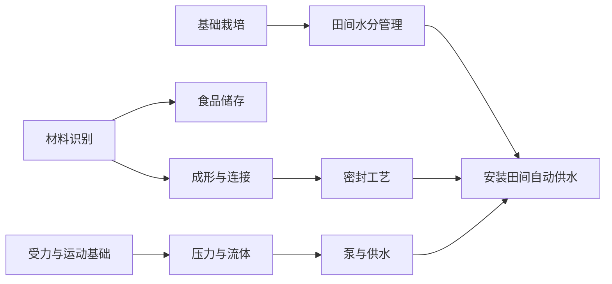
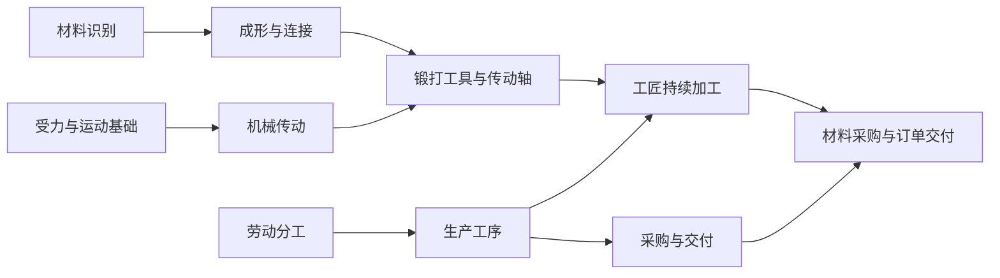
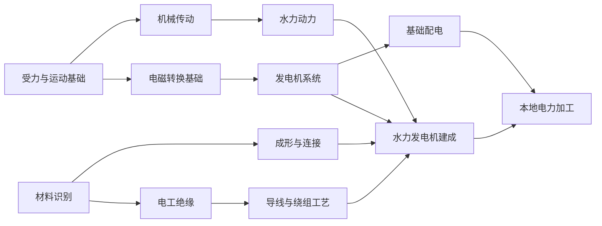

# 三条目标路线的分支树草案

状态：已按用户确认接入0.18.0三路线试点。下文保留原结构假设；实施规则、范围及新局策略见 ../docs/BRANCH_PATHS_V18.md。节点数量不等于已验证的推进速度。

## 设计假设与比较口径

取消“全科学科等级越高就能做更多东西”的门槛，改为掌握明确的能力节点。保留六科学科分类，公共基础后按需要分支。树的深度按根节点为第1层计算；下文节点总量包含所有跨科前置并去重，不只计算某一条看起来很短的分支。

三条路线采用同一口径：自行制造目标设备/部件，允许付费购买基础材料与半成品，不要求从采矿、冶炼到高分子合成全部自给。自给链是可选专业化，并没有免费省去材料、运输和资金。若选购买整机，应另算经营/使用路线，不能冒充自制路线的缩短。

初始已会A0，其余节点尚未掌握。节点计数表示知识结构，不代表已经验证的学习时间或通关季数。学新节点仍耗时间精力，需具体学习来源；不继续使用“所有高阶研究统一消耗电路”的规则。

## 共享节点与硬前置

同一节点在三条路线中只需学习一次。下表为完整试点节点集合；没有未列出的隐含学科等级前置。

| ID | 分类与节点 | 必须先会 | 掌握后用途 |
| --- | --- | --- | --- |
| A0 | 农学：基础栽培 | 无；开局已会 | 小麦播种、照料、收获 |
| A1 | 农学：田间水分管理 | A0 | 判断灌溉需求、配置田间供水；排水设施 |
| M0 | 材料：材料识别 | 无 | 识别木材、金属、纤维等用途，建立材料学习基础 |
| M1 | 材料：成形与连接 | M0 | 基础连接、锻打工具、机械部件制作 |
| M2 | 材料：密封工艺 | M1 | 油浸纤维密封、密封件制作 |
| M3 | 材料：食品储存 | M0 | 基础容器，增加食品保护容量 |
| M4 | 材料：电工绝缘 | M0 | 识别导体、绝缘体与绝缘失效，不要求先学密封或合金 |
| M5 | 材料：导线与绕组工艺 | M4 | 从铜料和绝缘材料制作导线、线圈，建立实际电工加工能力 |
| L0 | 力学：受力与运动基础 | 无 | 机械基础与简单提水器 |
| L1 | 力学：机械传动 | L0 | 轴、手摇传动；提供发电机机械装配基础 |
| L2 | 力学：压力与流体 | L0 | 压力、流量、阀门原理 |
| L3 | 力学：泵与供水 | L2 | 活塞泵、田间自动供水 |
| L4 | 力学：水力动力 | L1 | 水轮、转动动力的供给与使用 |
| L5 | 力学：电磁转换基础 | L0 | 发电、电动原理与电磁试验；不要求先走流体分支 |
| L6 | 力学：发电机系统 | L5 | 水力发电机制造和运行；制造另需L1、M1、M5 |
| L7 | 力学：基础配电 | L6 | 简单供电线路、负载与通断管理；不是区域输电工程 |
| O0 | 组织：劳动分工 | 无 | 招聘、明确个人和雇员职责，供粮协议 |
| O1 | 组织：生产工序 | O0 | 安排工匠持续加工、材料与设备占用 |
| O2 | 组织：采购与交付 | O1 | 供货协议、订单交付、按计划补货与销售 |

跨科要求列在产品中。例如L3课题本身不要求学完整材料支系，但制造可用的泵必须同时会M2。最终路线计数仍包含这些跨科节点，不能用这种展示方式隐去总负担。

## 路线一：稳定农业与自动灌溉

目标：本人会种田，建成储存和自动供水，减少缺水时的重复操作；保留播种收获的个人投入。农业完全托管是另一个可选目标。

必学集合：A0、A1、M0、M1、M2、M3、L0、L2、L3，共9节点，开局后新增8；最长学科路径3层。不得额外要求力学传动、热学、化学的完整主干。

| 小阶段 | 当下成果 | 本人能力与材料条件 | 还可以选择什么 |
| --- | --- | --- | --- |
| 种植与储存 | 能留住余粮 | A0、M0、M3；木材制作基础容器 | 先卖余粮、再改善供水 |
| 提水与管理 | 改善手动灌溉效率 | A1、L0；木材制作辘轳 | 环境水分充足时可以暂缓造泵 |
| 阀门与密封 | 有可维护的供水部件 | M1、M2、L2；铁料、纤维、油，锻打工具 | 买密封件，或自行发展油料纤维 |
| 自动灌溉 | 缺水季减少本人照料 | L3＋A1＋M2；泵、阀门、密封；持续水源、耗材与维护 | 后续再选农工托管、育种、肥力或排水方向 |

现有映射：W01→L0；S01→M3；T03→M1；密封配方→M2；阀门配方→L2＋M1＋M2；W03→L3＋M2；泵用于田间还需A1。泵原有铁2、阀1、密封1等实物成本先保留为待验证候选。

可跳过：机械传动、水轮、冶金、蒸汽、电磁、化工合成。油和纤维可付费购买；自制则另走油料/纤维专业分支。不能宣称9节点包含全材料自给。

验证目标：连续4个完整季记录缺粮、水源、田间管理时间和维修成本；与同条件手动供水比较，是否真正节省时间/精力。自动灌溉不应保证无旱灾、无缺粮，也不能创造不存在的水。

## 路线二：持续机械加工与销售

目标：以轴等机械部件为产品，有重复采购、生产、交付循环；本人可以转去学习或休息。重点是稳定经营，不是将所有机械设备都学会。

必学集合：M0、M1、L0、L1、O0、O1、O2，共7节点；最长3层。开局农学只服务于生活，不计入目标新增7项知识。

| 小阶段 | 当下成果 | 实际投入/约束 |
| --- | --- | --- |
| 本人试制 | 制成一批可用轴 | M1＋L1；锻打工具，木材与铁料 |
| 首次成交 | 找到可重复的用途和订单 | 手动出售无需先学O2；需求有限，按实际收货付款 |
| 工匠经营 | 不必本人每批都操作 | O0＋O1；招聘费、工资、材料、工具耐用与工序安排 |
| 采购交付 | 重复经营与周转 | O2；供货合同、运输、库存和现金预留；无原料/订单时停工 |

现有映射：T03→M1；轴配方→L1＋M1；招工→O0；工匠生产计划→O1；补货/销售→O2。工匠执行低阶既有工艺可以依靠已经建立的工艺规程；新产品试制仍需相应能力。价格、产量、工资初期沿用实物账，再验证是否盈利，不能预设肯定赚钱。

可选扩展：L4水轮＋食品加工形成另一条业务；纤维/绳索分支配合手摇传动；冶金分支用矿料替代买铁；维修或组织扩展降低停机。这些不是轴生意的必修课。

特别说明：现有手摇传动只增强纤维/绳索加工，不能因为名字叫“传动”就声称它会提高锻轴产量。本路线的初期效率收益来自分工和委托，而不是给工具凭空加成。

验证目标：至少8季收支、缺料、工资、停机、订单等待及本人投入；启动资产单列，奖励收入不计为持续盈利。允许市场波动导致停产，不保证无限收购或无风险套利。

## 路线三：水力发电与基本电工生产

目标：建成一台水力发电机，能制造导线和线圈，给一个本地负载供电。先形成小规模电气能力，再选择区域输电、化工、电池或电子方向。

必学集合：L0、L1、L4、L5、L6、L7、M0、M1、M4、M5，共10节点；最长4层。已经走过机械加工路线的人复用L0、L1、M0、M1，新增6节点即可进入此目标，不需要重学。

| 小阶段 | 当下成果 | 实际条件 |
| --- | --- | --- |
| 水轮与传动 | 先得到水力机械收益 | L4＋L1＋M1；水轮、轴、铁、水源；可先用于原有省力食品加工 |
| 电工材料 | 会做导线和绕组 | M4＋M5，铜料、绝缘材料、铁和锻打工具；材料仍需要采购 |
| 发电机 | 首次实际发电 | L6＋L1＋L4＋M1＋M5；线圈、轴、陶构件及安装；按现有水源/耐用消耗产电 |
| 基础配电 | 电力真正用于生产 | L7；真实电缆/连接与一个本地负载；无电时不能省力加工，超负载须取舍 |

现有映射：P03→L4＋L1＋M1；绝缘铜线→M5；线圈→M5＋M1；E01→L6＋L1＋L4＋M1＋M5；基本电缆→M5；本地用电接入→L7。现有电力辅助加工可作为本地负载，不必先建设洁净制造台或现代电子工厂。

默认购入铜料、现成绝缘聚合物、陶构件；保留现有导线与线圈的材料配方。没有暗中将油布当作等效高性能绝缘。自制聚合物另走反应控制、高分子和设备材料分支；购买半成品不会让玩家自动学会其制造知识。

可跳过：蒸汽内燃、油料合成、半导体、电池、数字控制、高压区域输电。基础电磁学习需有教学来源和低压试验材料，不能要求先制造发电机才能取得学习资格；生产验证发生在课题学习之后。

区域输电是后续可选项目，另要求线路与协作能力、连续有效供电，不能把原有力8/材8条件偷偷留在本地发电的入口。

验证目标：同场景建立水轮后，发电前后比较本人加工投入、水的农业竞争、维修、采购周转；记录至少4季供电与真实负载。发电机不是免费行动增幅器，不允许无水或重复启停刷电。

## 让购买路线真正成立：同步拆分供应渠道

下面是本草案的必要改动，尚未实现。如果仍要求“水利副本后供应6才能买铜”，上述浅树会被市场重新拉成长链。

| 渠道 | 获得方式草案 | 可提供 | 不要求 |
| --- | --- | --- | --- |
| 基础原料商 | 开局可访问，按价采购，供应有限 | 木黏土、纤维、油、少量铁料等 | 先通窑场/水利、先学会冶铁 |
| 稳定金属供货 | 达成首次有效机械交付，可支付订金签约；要求维持资金周转 | 较稳定铁料订单，仍有运费与到货时间 | 电力知识或全部中期科技 |
| 电工材料商 | 学会M4后可联络并支付采购/教学费用，按单订货 | 铜料、现成绝缘材料、入门电工教材 | 先造发电机、先通输电副本 |

首次接触提供采购机会，不赠送整套启动材料；重复稳定供应取决于合同和资金。渠道报价、库存、订金、运力是独立参数候选，尚未定值。设备整机交易需与材料渠道另区分，避免只学M4就能购买全套现代设备。

副本仍可提供信誉、稳定订单、渠道改善或一次性资源，但不作为学习相关知识的唯一通道。需防止订单需求不足导致无收入、材料涨价吞掉工资等情况；不能只证明按钮解锁。

## 三条路线的差异与衔接

| 目标 | 必需知识总数 | 开局后新增 | 最长路径 | 先获得的实际收益 | 可以暂时不学 |
| --- | --- | --- | --- | --- | --- |
| 稳定农业/自动灌溉 | 9 | 8 | 3层 | 储存、提水、自动灌溉 | 传动、蒸汽、电磁、化工自给 |
| 机械加工/销售 | 7 | 7 | 3层 | 试制成交、雇员经营、采购交付 | 水利、冶炼、电力 |
| 水力发电/电工生产 | 10 | 10；机械路线后新增6 | 4层 | 水力加工、导线、发电、本地负载 | 半导体、电池、数字控制、化工自给 |

三个目标合起来只涉及19个去重节点，并不是三棵各自重复学习的树。农学、材料、力学、组织分支覆盖本次代表目标；热学、化学完整树待后续专业化路线设计，不通过改名硬塞进必修范围。

潜在副作用：选择少量节点再采购可能过强，制造全链变得不划算；供应渠道过宽可能让中期失去探索；知识点过粗可能只是隐藏打包。下一步对比专业化采购与自给收益，而不是默认把采购全面削弱。

## 后续落地边界

本轮只有可审阅的结构变更，不更改正式规则、结算、存档或游戏界面，不运行测试/模拟。实际接入时需要新规则版本，将学习状态从每科整数改成节点集合；把上述产品、配方、雇员、项目、商城和观察的等级判断一起替换。旧档兼容不作为设计约束，不在本轮删除历史材料。

假设接受条件：三条路线都能解释每项必修知识的用途、原料有独立可达来源、学习不会依赖自己的产物、途中已有可用收益；这份静态草案满足结构解释，但可达性、时间精力成本和经营收益必须等实现后的最小对照确认。不能将文档节点计数当成已验证的游戏平衡结论。
