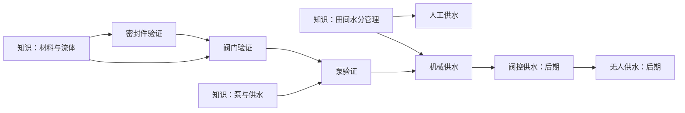
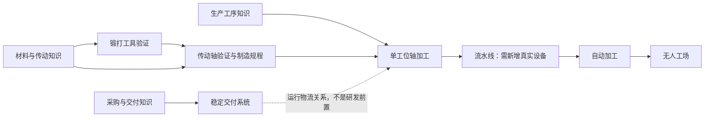

# 三类树：两条示例链与静态推演

配套 [预研主文](three-trees-preresearch.md)。仅结构示例，不是可运行配置或新版本实验结果。沿用0.18的节点含义与材料名称；所有新增系统ID及后期设备都是提案。K引用现有19节点，P中的设备尽量沿用现有ID；部件也归产品，原材料不强制进入产品升级树。

## 1. 农业供水

### 学科与产品

| 产品P | 直接知识K | 前置产品验证P | 实际制造/检验条件示例 |
| --- | --- | --- | --- |
| 锻打工具T03 | M1 | 无 | 木2、铁2；个人试制与工具检查 |
| 密封件seal | M2 | 无 | 纤维1、油1；试制和简单密封检查 |
| 阀门valve | L2、M1、M2 | seal | 铁1、密封件1；可用T03用于加工，检验启闭与密封 |
| 活塞泵W03 | L3、M2 | valve、seal | 铁2、阀1、密封件1；人工试抽，不要求灌溉系统已建 |
| 提水辘轳W01 | L0 | 无 | 木3；可以直接用于人工提水 |
| 排水设施U08 | A1、M1 | 无 | 木2、黏土2；排水能力检验 |

这里的P前置是技术/验证关系；配方材料与加工设备是实际操作条件。T03是加工阀门的设备，不要求为验证外购阀门也先自制T03。同理，买密封件可以保留外购路线，但买到后须具备M2并检验，才能作为后续产品技术前置；实物投入另按配方实际扣除。

不将W03旧`from: W01`照搬成硬依赖：辘轳不是泵的必要部件，强制先造辘轳只增加填充步骤。U08的排水与灌溉并列，不强制先修排水才能抽水。

K的父节点仍照常检查：M2←M1←M0，L3←L2←L0，A1←A0。这些K链不依赖任何上述P。

### 系统与运行

| 系统S | 解锁所需K | 解锁所需P记录 | 前置S记录 | 运行实例需求 |
| --- | --- | --- | --- | --- |
| 人工供水S:field-hand | A1 | 无 | 无 | 人工提水任务、公共水、目标田地；W01可选，改善任务效率 |
| 机械供水S:field-pump | A1、O0 | W03 | 无 | 安装可用泵、操作人员、耗材、水源与维护 |
| 阀控供水S:field-controlled（后期占位） | 待定义的控制知识 | 待定义的传感/执行设备、W03 | field-pump | 传感与阀控替代日常启停，仍有检修/补料任务 |
| 无人供水S:field-unattended（后期占位） | 待定义的自动维护/调度知识 | 待定义的物流、自动维护设备 | field-controlled | 无人工岗位；水、能、备件、自动供料与维护依赖完整 |

机械供水不要求人工系统调试记录：两者是替代入口，玩家可以从一开始选机械化。后续阀控确实改造泵系统，才要求field-pump记录。没有为了凑系统等级强制每种系统都走“人工→机械→流水线→自动化”。

图为阅读简图，准确AND条件以表为准；后期未定义K/P不算已通过引用完整性检查，不是可立即开放节点。

与0.18的关键差别：旧“自动灌溉”其实是自动执行结算，不计操作人员。候选机械供水每次有效抽水需有人操作；因此不能宣传为无代价改善。它必须通过更低的劳动需求、供水能力或覆盖范围体现相对于人工提水的收益，否则只是在削弱旧泵。

资源模型也要解释：0.18泵耗木材1作为运行耗材。候选暂保留这个实物成本进行对照，但不把木材自动称为动力燃料；真正的动力来源须显式指定人力、水力或电力。后续改变耗材含义/配方另建参数候选。

## 2. 机械加工

### 学科与产品

| 产品P | 直接知识K | 前置产品验证P | 制造与验证 |
| --- | --- | --- | --- |
| 锻打工具T03 | M1 | 无 | 同供水链，共享产品记录 |
| 传动轴shaft | L1、M1 | T03 | 木2、铁1；占用可用T03，试制两件并检查传动 |
| 手摇传动P01 | L1、M1 | shaft | 木3、轴1；人力负载试验 |
| 水轮动力P03 | L4、M1 | shaft | 木4、铁1、轴1；实际水源和负载试验 |
| 磨粮装置U06 | L1、M1 | 无 | 木2、陶构件1；实际磨粮试验 |

T03→shaft在这里作为工具加工精度的产品经验前置；若后续认为外购轴检验不需要T03经验，可以删掉这条技术前置，但不得把运行所需锻打设备一并删掉。它是需要通过可达性对照判断的候选，不是既成事实。

不照搬P03旧`from: P01`或U06旧`from: U05`：水轮需要轴与水力知识，不必先造手摇传动；磨粮不必先造脱粒装置。P01目前在0.18对纤维/绳索的增益不能伪称对传动轴锻打有效。动力驱动锻打流水线需要新增动力锤/机床等产品，不能装一个水轮就自动给所有配方翻倍。

### 系统与运行

| 系统S | 解锁所需K | 解锁所需P记录 | 前置S记录 | 运行实例需求 |
| --- | --- | --- | --- | --- |
| 单工位轴加工S:shaft-cell | O1 | T03、shaft | 无 | T03、轴制造规程、搬运/加工/检验任务、原料与工匠 |
| 稳定交付S:delivery | O2 | 无 | 无 | 合同、订单、仓储、运输、交付任务与实际资金 |
| 轴加工流水线S:shaft-line（后期占位） | 待定义的工序协调/标准化知识 | 待定义的送料装置、动力加工设备、检具 | shaft-cell | 少量操作/检验任务，稳定供料、动力与维护 |
| 自动加工S:shaft-controlled（后期占位） | 待定义的控制知识 | 待定义的控制/执行设备 | shaft-line | 降低日常操作，仍有人维护与补料 |
| 无人工场S:shaft-unattended（后期占位） | 待定义的无人调度知识 | 待定义的自动物流/维护设备 | shaft-controlled、无人物流/维护系统（待定义） | 零必需人工任务及完整依赖供应 |

稳定交付独立于生产，既可服务农产品也可服务工业产品；生产系统不必先开启自动销售才能工作。加工规程解决“怎么做”，组织知识解决“怎么安排”，两者不互相赠送。

## 3. 劳动静态推演

下列数值只用于检验预算模型，不替换0.18报价。统一完成一份既定供水任务、一个既定加工批次，物料与有效产出在比较中保持一致。不能把降低产量造成的少用工叫效率改善。

| 任务方案 | 任务组合 | 合计时间 | 合计精力 |
| --- | --- | --- | --- |
| 人工供水 | 提水并送达4/4 | 4 | 4 |
| 机械供水 | 设置与操作2/1 | 2 | 1 |
| 单工位加工 | 搬运2/1、加工4/4、检验2/1 | 8 | 6 |
| 加工流水线 | 补料1/1、操作2/1、检验1/1 | 4 | 3 |

报价写法为时间/精力。机械和流水线还需设备与动力，表中没有摊销维护，不代表总成本已降低。

同一位有12时间、8精力的人：人工供水+单工位加工合计12时间/10精力，不能完整承担；增加休息又会超过12时间，必须改派、跨季或减少需求。机械供水+单工位加工合计10时间/7精力，在该季预算内可行；机械供水+流水线合计6时间/4精力，才真实留下可用于学习、维修或别处工作的余量。

这不是长期可持续性证明：当前人生规则季末基本恢复3精力，单季消耗7不能无限循环。候选任务必须连同休息、健康上限、工资和维修连续结算，不能仅以初始满精力判断长期少用几个人。

对工匠技能、人力兼职的限制同样检查：有空闲时间但没有检验资格，不能自动顶替检验岗；流水线将任务拆得很碎时不能无限切分时间获得零计费劳动。

## 4. 静态边界审查

| 情境 | 本候选应有的结果 |
| --- | --- |
| 卖掉验证过的密封件 | 验证记录保留；做阀门时仍要有新的实物密封件 |
| 直接买一台泵 | 有实物，不自动学会L3，也不直接取得制造规程；合格检验后可取得产品验证 |
| 检验泵但尚未建机械供水 | 允许人工试抽；不存在系统→产品的解锁环 |
| 阀门加工缺T03 | 不能自制；可以采购检验阀门，代价与规程收益不同 |
| 同一人分配两系统又手动做工 | 手动动作只能使用未预留预算，不得季末双花 |
| 同一设备安装两系统 | 第二次安装被拒绝；同一系统的多人任务也共享设备容量 |
| 本季不缺水 | 灌溉任务不运行、不扣抽水工资与物料；巡检若有必须另列 |
| 水源为空或资金不够 | 对应生产任务不扣部分原料、时间或工资，显示准确缺项 |
| 旧泵自动逻辑未移除 | 新旧各生效一次是错误，必须在实现验收中拒绝 |
| 前代退休，后代不会泵原理 | 既有已调试系统可由合格操作员继续；研发新泵仍检查研发者知识 |
| 流水线没订单 | 可按备货上限待命，不能为展示产量强制无限生产 |
| 自动加工需有人换备件 | 标记自动操作，不能标记无人运行 |
| 无人系统使用有人供货 | 仅本站无人；供应链仍有人力依赖 |
| 自动维护设备维修自身 | 必须有备用/冗余维护能力或可更换模块与实物库存，否则维护窗口停机，不凭空自愈 |

静态结果：这两条早期链的明确前置能够按K→P→S排列，无需学科反向依赖实物；共享工具/密封等记录可去重，流水线有真实削减任务的表达方式。后期占位节点尚未定义全部学科、产品、维修依赖，不能宣布后期全树无环、可达或平衡通过。

建议先接受分类与状态语义，随后实现两个早期系统，验证真实劳动账本，再扩标准化、传感、控制、自动物流和维护分支。先看同产出省下多少人力及花了多少资本，再决定具体节点数量。
